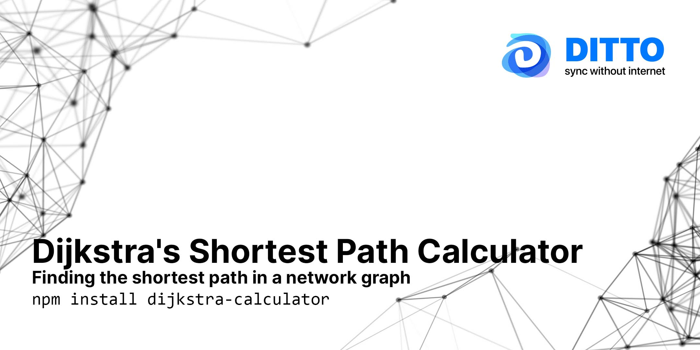

# A Typescript implementation of Dijkstra's shortest path algorithm

- **GitHub URL**: https://github.com/getditto/dijkstra-calculator
- **TypeDoc Link**: https://getditto.github.io/dijkstra-calculator
- Built with [](http://www.typescriptlang.org/)
- Continuous Integration Status 

Use this to find the shortest path of nodes in graph using [Dijkstra's algorithm](https://en.wikipedia.org/wiki/Dijkstra%27s_algorithm). [Learn how to pronounce Dijkstra here](https://www.youtube.com/watch?v=lg6uIPSvclU).

This library a TypeScript port from [Alfred Gatsby @Prottoy2938](https://github.com/Prottoy2938) for the great work done here: https://gist.github.com/Prottoy2938/66849e04b0bac459606059f5f9f3aa1a

At [Ditto](https://www.ditto.live) we do a lot of imagery with [react-force-graph](https://github.com/vasturiano/react-force-graph) to show how our mesh network can establish virtual connections between peers. This library is used to aid in showing the shortest path between peers. Note: we use a modified version of Dijkstra's Algorithm with differing priority per link as a consideration for our system. This library is primarily used for assisting in simple visualizations in our documentation and blog.

## Installation

Use either `npm` or `yarn` to install the library. This library is targeting ES5 and can be run on either Web, Node, or Electron projects. It does not have any dependencies.

```sh
npm install dijkstra-calculator
# or if you're using yarn
yarn add dijkstra-calculator
```

## Usage:

Let's say you want to find the shortest path between two nodes in the graph.
Given a series of Nodes in a graph with identifiers `"A "`to `"F"` and edges established between each one

```js
import { DijkstraCalculator } from 'dijkstra-calculator';

const graph = new DijkstraCalculator();

graph.addVertex('A');
graph.addVertex('B');
graph.addVertex('C');
graph.addVertex('D');
graph.addVertex('E');
graph.addVertex('F');

graph.addEdge('A', 'B');
graph.addEdge('A', 'C');
graph.addEdge('B', 'E');
graph.addEdge('C', 'D');
graph.addEdge('C', 'F');
graph.addEdge('D', 'E');
graph.addEdge('D', 'F');
graph.addEdge('E', 'F');

// Now you can calculate the shortest distance between A and E
const path = graph.calculateShortestPath('A', 'E');
// this will print ['A', 'B', 'E']
```

### Adding weights to edges

There are instances where you'd like to add some priority or weight to an edge. The 3rd parameter

```js
import { DijkstraCalculator } from 'dijkstra-calculator';

const graph = new DijkstraCalculator();
graph.addVertex('A');
graph.addVertex('B');
graph.addVertex('C');
graph.addVertex('D');
graph.addVertex('E');
graph.addVertex('F');

graph.addEdge('A', 'B', 4);
graph.addEdge('A', 'C', 2);
graph.addEdge('B', 'E', 3);
graph.addEdge('C', 'D', 2);
graph.addEdge('C', 'F', 4);
graph.addEdge('D', 'E', 3);
graph.addEdge('D', 'F', 1);
graph.addEdge('E', 'F', 1);

const path = graph.calculateShortestPath('A', 'E');
// with consideration of the weights at the edge, the values will be ['A', 'C', 'D', 'F', 'E']
```

### Getting a Linked List instead of a string array

Libraries like [d3](https://d3js.org/) or [Vis.js](https://visjs.org/) or [force-graph](https://github.com/vasturiano/react-force-graph/) will want a structure to specify edges that looks something like this:

```js
[
  { source: 'A', target: 'B' },
  { source: 'C', target: 'D' },
  // etc...
];
```

You can get something that fits these APIs by calling `calculateShortestPathAsLinkedListResult` like below:

```js
const linkedList = graph.calculateShortestPathAsLinkedListResult('A', 'E')
// This will result in `linkedList` with the following contents
[
  { source: 'A', target: 'C' },
  { source: 'C', target: 'D' },
  { source: 'D', target: 'F' },
  { source: 'F', target: 'E' },
];
```

## Pronunciation Of Dijkstra

Not sure how to pronounce Dijkstra? https://www.youtube.com/watch?v=lg6uIPSvclU
